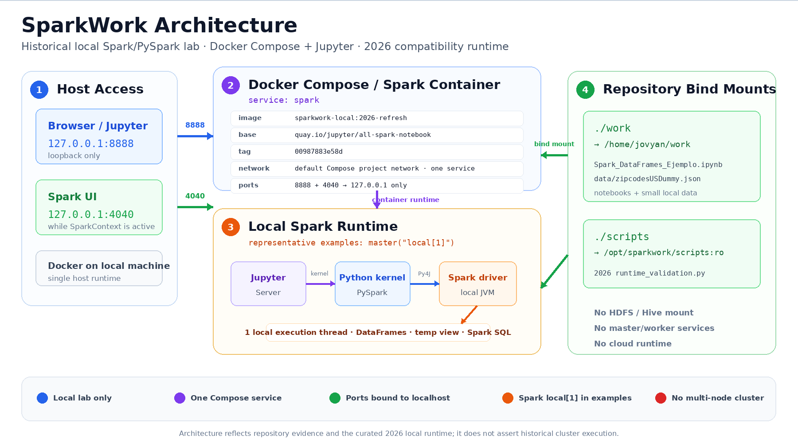

# SparkWork

<p align="left">
  <a href="https://spark.apache.org/" title="Apache Spark">
    
  </a>
  <a href="https://jupyter.org/" title="Jupyter">
    
  </a>
  <a href="https://www.python.org/" title="Python">
    
  </a>
  <a href="https://docs.docker.com/compose/" title="Docker Compose">
    
  </a>
  <a href="https://github.com/HubertRonald/SparkWork/commits/main" title="GitHub last commit">
    
  </a>
  <a href="./LICENSE" title="MIT License">
    
  </a>
</p>

<p align="center">
  <strong>Historical local Spark/PySpark lab for DataFrame transformations and Spark SQL.</strong>
</p>

<p align="left">
  
  
  
  
  
</p>

---

> **Status:** Historical project, original activity 2023-06-05 → 2023-08-05.
>
> **2026 refresh:** security, reproducibility, provenance, architecture, and portfolio documentation only. The refresh does not rewrite the original Git history.

## Overview

SparkWork packages a Jupyter + Apache Spark development environment in Docker and contains a representative PySpark notebook. The repository demonstrates DataFrame operations and Spark SQL on small local data.

It is **not** evidence of a multi-node Spark cluster. In the representative notebook, examples 2 and 3 explicitly configure `master("local[1]")`, which is local single-machine Spark with one worker thread for those sessions.

## Architecture

<p align="center">
  
</p>

<p align="center">
  <em>
    Single-machine Docker Compose workflow: loopback-only Jupyter/Spark UI access,
    one Spark container, repository bind mounts, and a local PySpark/Spark SQL runtime.
  </em>
</p>

The runtime flow represented above is:

```text
Host browser
  │
  └── 127.0.0.1:8888
        │
        ▼
Docker Compose service: spark
        │
        ├── Jupyter Server
        │      │
        │      ▼
        │   Python kernel / PySpark
        │      │
        │      ▼
        │   SparkSession
        │      │
        │      └── local[1] in representative notebook examples
        │             │
        │             ├── DataFrame transformations
        │             └── temporary view + Spark SQL
        │
        ├── ./work    → /home/jovyan/work
        └── ./scripts → /opt/sparkwork/scripts:ro

Spark UI, while a SparkContext is active:
  127.0.0.1:4040
```

There is one Compose service and no repository evidence of a standalone Spark master/worker cluster, YARN, HDFS, Hive storage, or a cloud-managed Spark runtime.

## What the notebook demonstrates

`work/Spark_DataFrames_Ejemplo.ipynb` includes:

- creating DataFrames from in-memory Python structures;
- inspecting schemas and rows;
- expanding nested arrays and maps with `explode`, `explode_outer`, `posexplode`, and `posexplode_outer`;
- reading multiline JSON with an explicit `StructType` schema;
- aggregating with `groupBy(...).count()`;
- registering a temporary view;
- executing an equivalent aggregation with `spark.sql(...)`.

The repository does **not** demonstrate RDD-focused jobs, Structured Streaming, MLlib, HDFS/Hive storage, cluster scheduling, explicit partition tuning, cache/persist, broadcast joins, executor tuning, or measured performance optimization.

## Original context and period

The original repository commit activity observed in the 2026 audit spans 2023-06-05 through 2023-08-05. The work is best treated as an individual historical Spark lab and as evidence of the transition toward data-processing/platform engineering concepts.

The exact original Spark/Scala/Java versions are not recoverable from the repository configuration because the historical Dockerfile used an unpinned `jupyter/all-spark-notebook` image.

The notebook metadata records Python 3.11.4, but that metadata alone does not identify the complete historical container runtime.

## 2026 compatibility runtime

The refresh pins the Jupyter Docker Stacks base image tag used for validation instead of relying on a moving `latest` tag. This is a **2026 compatibility runtime**, not a claim about the exact image used in 2023.

The retained notebook-specific Python dependency is pinned in `requirements.txt`.

## Quick start

Prerequisite: Docker with Docker Compose.

```bash
chmod +x start.sh stop.sh
./start.sh
```

The container publishes Jupyter only on the host loopback interface (`127.0.0.1:8888`). Jupyter generates an authentication token at runtime; no notebook password is stored in the repository. `start.sh` prints recent container logs so the local token URL can be copied from the console.

Stop the environment with:

```bash
./stop.sh
```

If you need to override the pinned compatibility image locally:

```bash
cp .env.example .env
```

Then edit only your local `.env`. The file is ignored by Git.

## Representative validation

After the container is running:

```bash
docker compose exec -T spark spark-submit /opt/sparkwork/scripts/runtime_validation.py
```

A successful run ends with:

```text
SPARKWORK_RUNTIME_VALIDATION=PASS
```

The validation checks the nine-row ZIP-code sample through both DataFrame aggregation and Spark SQL, expecting:

```text
NY -> 2
PR -> 7
```

## Dataset

`work/data/zipcodesUSDummy.json` is a small sample attributed by the historical README to:

```text
https://github.com/millbj92/US-Zip-Codes-JSON
```

That upstream repository presents an MIT license. See [`docs/DATA_PROVENANCE.md`](docs/DATA_PROVENANCE.md) for the publication/provenance note.

## Security note

The historical repository tracked a local `.env` and included a default notebook password together with root/sudo-oriented Compose settings. The 2026 refresh removes that file from the current tracked tree, removes the password/root/sudo path, and restricts published ports to loopback. Git history is intentionally preserved rather than rewritten.

If a historical credential was ever reused in another system, it should be rotated in that system; repository sanitization alone cannot revoke an external credential.

## Evidence and limitations

See [`docs/AUDIT_2026.md`](docs/AUDIT_2026.md) for the evidence index, historical/runtime limitations, and the conservative Builder Journey interpretation.

## Author

<p>
  <a href="https://github.com/HubertRonald">
    <strong>Hubert Ronald</strong>
  </a>
  — initial implementation and 2026 portfolio curation.
</p>

## License

SparkWork is licensed under the MIT License. See [`LICENSE`](LICENSE).
