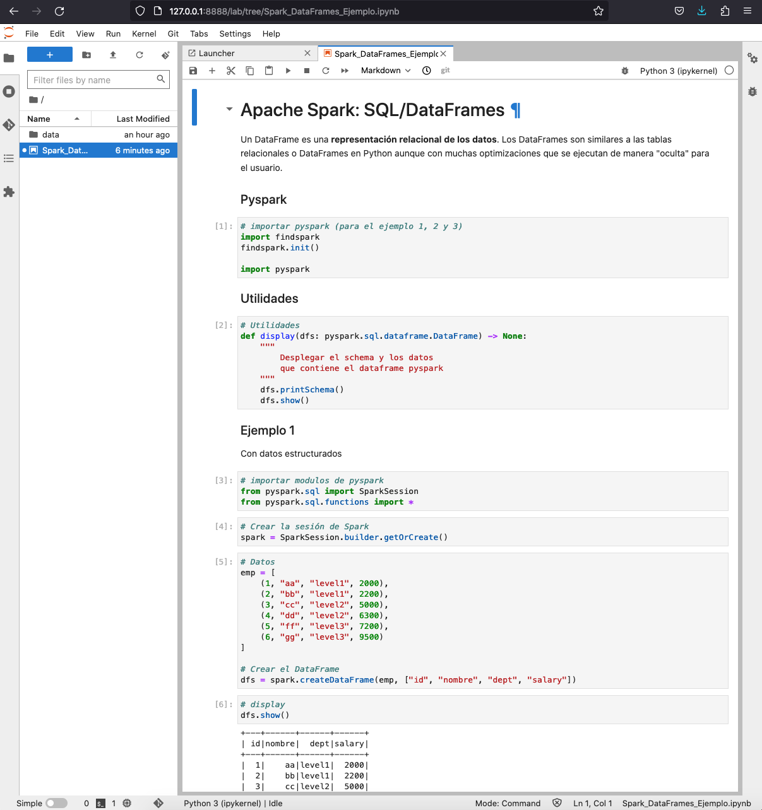

[](https://archive.apache.org/dist/spark/)
[](https://jupyter-docker-stacks.readthedocs.io/en/latest/index.html)
[](https://www.python.org/dev/peps/pep-0537/#schedule-first-bugfix-release)
[](https://hub.docker.com/r/jupyter/all-spark-notebook/tags?page=2)

[](LICENSE)


# SparkWork
Puedes correr un ambiente standalone de spark en local


# Inicio

Una vez se clone el proyecto

```bash
git clone https://github.com/HubertRonald/SparkWork.git
``` 

Se puede iniciar rápidamente desde la terminal con (desde la carpeta `SparkWork`):

```bash
./quick_start.sh
```

Copia el siguiente enlace


Asegurase de no tener abierto alguna sesión previa. Caso contratio cerrar esa pestaña del navegador y ejecutar nuevamente el script `./quick_start.sh` en la terminal

Hecho lo anterior se debería ver una carpeta work en la parte izquierda al ingresar se verá el notebook `Spark_DataFrames_Ejemplo.ipynb`




# Enlaces

- [Jupyter Docker Stacks](https://jupyter-docker-stacks.readthedocs.io/en/latest/index.html)

- [Specific Docker Image Options](https://jupyter-docker-stacks.readthedocs.io/en/latest/using/specifics.html#specific-docker-image-options)


# .gitignore

Fue generado en [gitignore.io](https://www.toptal.com/developers/gitignore/) con los filtros `python`, `macos`, `windows` y consumido mediante su API como archivo crudo desde la terminal:

```bash
curl -L https://www.toptal.com/developers/gitignore/api/python,macos,windows > .gitignore
```


# Autores
---
* **Hubert Ronald** - *Trabajo Inicial* - [HubertRonald / SparkWork](https://github.com/HubertRonald/SparkWork)

Ve también la lista de [contribuyentes](https://github.com/HubertRonald/SparkWork/contributors) que participaron en este proyecto.


# Licencia
---
Este proyecto está bajo licencia MIT - ver la [LICENCIA](LICENSE) archivo (en inglés) con más detalles